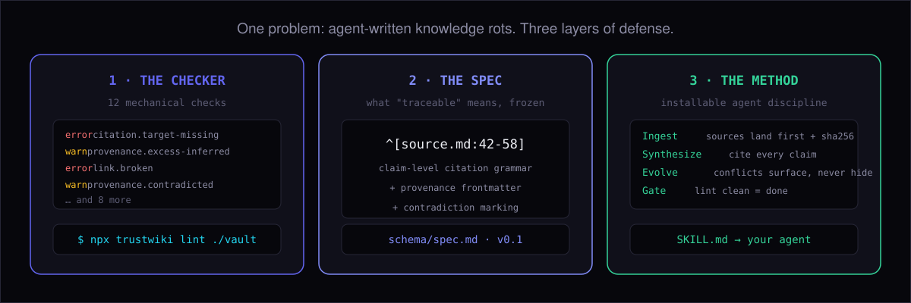
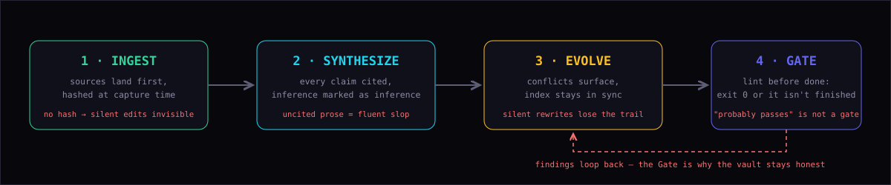
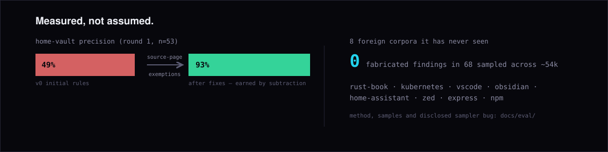
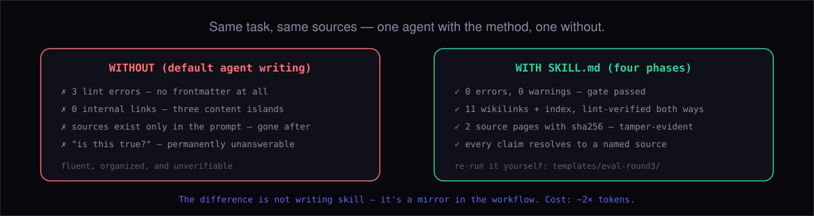

<p align="center">
  
</p>

<p align="center">
  <a href="https://github.com/QianJinGuo/trustwiki/actions/workflows/ci.yml"></a>
  <a href="https://www.npmjs.com/package/trustwiki"></a>
  = 18">
  
</p>

English · [简体中文](README.zh.md)

# trustwiki

**Your agent writes your notes. Who checks them?**

Every knowledge base maintained by an AI agent eventually rots the same way:
claims nobody can trace, contradictions quietly rewritten away, links that
die. trustwiki is the checker — it reads your markdown vault and tells you
exactly where the rot is.

```bash
npx trustwiki lint ./your-notes
```

```text
notes/benchmarks.md
  L9    warn  provenance.stale-claim      source ingested 2026-06-08 — held 89d (half-life 59d)
notes/sloppy-page.md
  L12   error citation.target-missing   citation target not found: sources/ghost.md
  L14   warn  provenance.excess-inferred 3/5 prose paragraphs uncited (>0.3)
  L18   error link.broken                 broken wikilink [[notes/dead-ref]]

Σ 3 errors, 6 warnings across 4 files
```

That is a real report on a vault seeded to fail — including a claim that has
outlived its measured half-life. [See it run (10s GIF)](#2-see-it-run) · [What each finding means](#what-each-check-catches)

## Why it exists

AI agents already write knowledge bases — research wikis, team docs, personal
notes. Nobody proofreads them, because the volume is inhuman. The failure mode
is **fluent slop**: confident prose, zero provenance, contradictions resolved
by whoever edits last.

trustwiki is the discipline layer. It does **not** build your wiki — it makes
sure that when your agent does, every claim traces to a source, disagreements
stay visible, and decay is measured instead of discovered two months later.

It is three things:

<p align="center">
  
</p>

- **A checker** — 13 mechanical checks: citations (grammar, targets, staleness), contradictions, broken links, index drift, orphans
- **A spec** — a frozen, versioned definition of "traceable": [schema/spec.md](schema/spec.md)
- **A method** — the four-phase discipline your agent installs: [SKILL.md](SKILL.md)

## Getting started

### 1. Try it on the demo (30 seconds, nothing to install)

```bash
git clone https://github.com/QianJinGuo/trustwiki && cd trustwiki
npx trustwiki lint templates/demo-vault     # a vault seeded to fail: 8 findings, exit 1
npx trustwiki lint templates/starter-vault  # the same structure built to pass: exit 0
```

### 2. See it run


### 3. Run it on your own vault

Already keep notes in markdown (Obsidian, Logseq, plain files)? Just point at
the directory. Zero config works:

```bash
npx trustwiki lint ~/Documents/my-notes
```

Most users then add one small `.trustwiki.json` at the vault root so the
checker understands your layout:

```json
{
  "roots": ["notes", "sources"],
  "index": "index.md",
  "sourceDir": "sources",
  "halfLives": { "terminology": 30, "model-generation": 59, "release-expectation": 110 }
}
```

- `roots` — which directories to scan
- `index` — your index file, if you keep one (enables index-drift checks)
- `sourceDir` — where raw captured sources live (enables citation-target
  checks, and exempts those pages from "author's voice" rules — they quote,
  they don't cite)
- `halfLives` — claim-class → days until a cited claim is flagged stale
  (sources opt in with `claim_class:` or `halflife_days:` in frontmatter)

Full reference: [schema/spec.md](schema/spec.md).


### Already have an Obsidian / Logseq vault?

It works on your vault today, as-is — broken `[[wikilinks]]`, real TODOs, and
dangling index entries are findable without any setup. If the provenance
culture is not (yet) your vault's culture, switch off those rules and keep the
checks that are language-agnostic:

```json
{
  "rules": {
    "provenance.excess-inferred": "off",
    "provenance.low-confidence": "off",
    "citation.target-missing": "off",
    "frontmatter.required": "warn",
    "frontmatter.fields": "off"
  }
}
```

That is the honest floor: **broken-link and placeholder detection help any
markdown vault**; the citation layer becomes valuable when you start capturing
sources (see [SKILL.md](SKILL.md) Phase: Ingest).

### 4. Make your agent maintain the vault under the same rules

Install the method as an agent skill: copy
[SKILL.md](SKILL.md) into your agent's skills directory (Claude Code, Codex,
and most CLIs support project or global skills).

<p align="center">
  
</p>

It teaches your agent the four phases with the violation consequences that
motivated each rule. The short version of the whole method is one line:
**never write a claim your vault cannot trace.**

### 5. Gate your CI (optional)

```bash
npx trustwiki lint ./your-notes        # exit 0 = clean, 1 = errors present
npx trustwiki lint ./your-notes --json # machine-readable for CI bots
```

## What each check catches

| check | catches | example |
|---|---|---|
| `citation.malformed` | citations that don't parse — decoration, not provenance | `^[maybe a source?]` |
| `citation.target-missing` | cited files that don't exist | `^[sources/ghost.md]` |
| `provenance.excess-inferred` | pages that are mostly uncited prose | 3/5 paragraphs, no `^[…]` |
| `provenance.low-confidence` | pages admitting they're shaky | `confidence: 0.3` |
| `provenance.contradicted` | conflicts marked in body but not frontmatter (or vice versa) | callout without `contradicted_by` |
| `provenance.stale-claim` | claims held past their measured half-life — verify or re-cite | 89d held, half-life 59d |
| `link.broken` | `[[wikilinks]]` that resolve to nothing | `[[notes/dead-ref]]` |
| `link.index-missing` | pages missing from the index; index entries that dangle | either direction |
| `page.orphan` | pages with almost no outbound links — islands rot first | 0 links |
| `frontmatter.required` / `.fields` | missing metadata; sources missing `sha256` (how silent edits get caught) | no `created` date |
| `placeholder.present` | TODO/FIXME posing as finished content | `TODO: finish` |

Severity of each is configurable (`error | warn | off`), warnings never fail
the build, and the full rule reference lives in
[schema/spec.md](schema/spec.md).

## Proven in production

<p align="center">
  
</p>

This tool is the extracted discipline of an agent-maintained wiki that has
run since 2026-05: **8,658 pages, 4,162 raw sources, 0 lint errors** — every
number with source and verification date in [proof/STATS.md](proof/STATS.md).

And the method itself was A/B tested on an identical task — one agent with
SKILL.md, one without:

<p align="center">
  
</p>

Re-run the experiment yourself in 30 seconds:
[templates/eval-round3/](templates/eval-round3/) · full reports in [docs/eval/](docs/eval/).

## FAQ

**Is this for Obsidian/Logseq users or for agent builders?**
Both. If you keep markdown notes, `npx trustwiki lint` finds rot today. If
you build agents, [SKILL.md](SKILL.md) makes your agent write vaults that
pass the same check.

**Does it modify my files?**
No. It reads and reports only. There is no `--fix` on purpose: fixes that
matter require knowing which source supports the claim, and no tool can
guess that for you.

**Does it send my notes anywhere?**
No. Local files in, stdout out. Zero dependencies, zero telemetry.

**My vault isn't agent-written — is this still useful?**
Yes, if it has citations to check or links that can rot. The contradiction
and broken-link checks help any markdown knowledge base.

## License

MIT.
