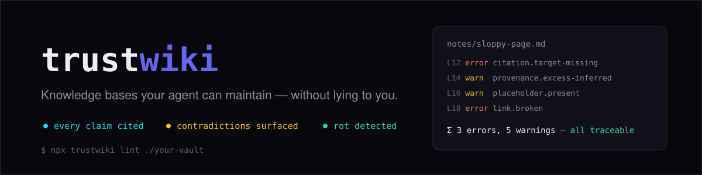

<p align="center">
  
</p>

<p align="center">
  <a href="https://github.com/QianJinGuo/trustwiki/actions/workflows/ci.yml"></a>
  <a href="https://www.npmjs.com/package/trustwiki"></a>
  = 18">
  
</p>

[English](README.md) · 简体中文

# trustwiki

**你的 agent 在替你写笔记。谁在检查它们？**

所有由 AI agent 维护的知识库，最终都以同一种方式腐烂：没人能溯源的论断、
被悄悄改写抹平的矛盾、死掉的链接。trustwiki 是检查器——它读你的 markdown
知识库，精确告诉你烂在哪里。

```bash
npx trustwiki lint ./your-notes
```

```text
notes/model-comparison.md
  L12   error citation.target-missing   citation target not found: sources/ghost.md
  L14   warn  provenance.excess-inferred 3/5 prose paragraphs uncited (>0.3)
  L16   warn  placeholder.present        placeholder text: TODO
  L18   error link.broken                 broken wikilink [[notes/dead-ref]]

Σ 3 errors, 5 warnings across 3 files
```

这是一座"造出来就是为了失败"的知识库上的真实报告。[看它运行（10 秒 GIF）](#2-看它运行) · [每条 finding 是什么意思](#每条检查抓什么)

## 为什么有它

AI agent 已经在替人写知识库——研究 wiki、团队文档、个人笔记。没人校对，
因为工作量不是人能承受的。失败模式叫**流畅的 slop**：自信的散文、零溯源、
矛盾被最后编辑的人悄悄裁决。

trustwiki 是纪律层。它**不**替你长出 wiki——它保证的是：当你的 agent
动笔时，每个论断能追溯到来源，分歧保持可见，腐烂被仪器测出来而不是
两个月后被人撞见。

它是三样东西：

| 层 | 是什么 | 在哪 |
|---|---|---|
| **检查器** | 12 条机械检查：引用、矛盾、断链、索引漂移、孤页 | 本 CLI |
| **规范** | "可溯源"的冻结版本化定义——`^[source.md:42-58]` 引用文法 | [schema/spec.zh.md](schema/spec.zh.md) |
| **方法** | 四阶段操作纪律（Ingest → Synthesize → Evolve → Gate），agent 可安装 | [SKILL.md](SKILL.md) |

## 上手

### 1. 在 demo 上试（30 秒，无需安装任何东西）

```bash
git clone https://github.com/QianJinGuo/trustwiki && cd trustwiki
npx trustwiki lint templates/demo-vault     # 造出来为了失败的库：8 条 findings，退出码 1
npx trustwiki lint templates/starter-vault  # 同样结构、造出来为了通过的库：退出码 0
```

### 2. 看它运行


### 3. 用在你自己的知识库上

已经在用 markdown 记笔记（Obsidian、Logseq、纯文件）？直接指向目录，
零配置可用：

```bash
npx trustwiki lint ~/Documents/my-notes
```

然后多数人会加一个小小的 `.trustwiki.json`，让检查器理解你的目录布局：

```json
{
  "roots": ["notes", "sources"],
  "index": "index.md",
  "sourceDir": "sources"
}
```

- `roots`——扫描哪些目录
- `index`——你的索引文件（可选，声明后启用索引漂移检查）
- `sourceDir`——原始抓取来源所在目录（启用引用目标检查；这些页豁免
  "作者声音"类规则——它们引用来源，不需要引用自己）

完整参考：[schema/spec.zh.md](schema/spec.zh.md)。


### 已经有一个 Obsidian / Logseq 库？

今天就能直接用——断掉的 `[[wikilink]]`、真实的 TODO、悬空的索引项，零配置
即可找出。如果溯源文化还不是你的库的文化，把那部分规则先关掉，保留与语言
无关的检查：

```json
{
  "rules": {
    "provenance.excess-inferred": "off",
    "provenance.low-confidence": "off",
    "citation.target-missing": "off",
    "frontmatter.required": "warn",
    "frontmatter.fields": "off"
  }
}
```

这是诚实的下限：**断链与占位符检查对任何 markdown 库都有用**；引用层在
你开始捕获来源后才会显现价值（见 [SKILL.md](SKILL.md) Phase: Ingest）。

### 4. 让你的 agent 按同一套规则维护

把方法装成 agent skill：复制 [SKILL.md](SKILL.md) 到你 agent 的 skills
目录（Claude Code、Codex 和多数 CLI 都支持项目级或全局 skill）。它教你的
agent 四个阶段——**Ingest → Synthesize → Evolve → Gate**——以及每条规则
背后的违规后果。整个方法的一句话版本：**永远不要写下你的知识库无法溯源
的论断。**

### 5. 进 CI 门禁（可选）

```bash
npx trustwiki lint ./your-notes        # 退出码 0 = 干净，1 = 有 error
npx trustwiki lint ./your-notes --json # 机读输出，给 CI bot
```

## 每条检查抓什么

| 检查 | 抓什么 | 例子 |
|---|---|---|
| `citation.malformed` | 解析不了的引用——是装饰不是溯源 | `^[maybe a source?]` |
| `citation.target-missing` | 被引用的文件不存在 | `^[sources/ghost.md]` |
| `provenance.excess-inferred` | 大部分段落无引用的页面 | 3/5 段落没有 `^[…]` |
| `provenance.low-confidence` | 自己承认心虚的页面 | `confidence: 0.3` |
| `provenance.contradicted` | 冲突只在正文标记、或只在 frontmatter 标记 | 有 callout 无 `contradicted_by` |
| `link.broken` | 解析不到任何东西的 `[[wikilink]]` | `[[notes/dead-ref]]` |
| `link.index-missing` | 页面不在索引里；或索引项悬空 | 双向都查 |
| `page.orphan` | 几乎没有出链的页面——孤岛先腐烂 | 0 条出链 |
| `frontmatter.required` / `.fields` | 缺元数据；来源页缺 `sha256`（静默篡改的发现手段） | 没有 `created` |
| `placeholder.present` | 冒充完成品的 TODO/FIXME | `TODO: finish` |

每条的严重度可配置（`error | warn | off`），warning 永远不导致失败，
完整规则参考在 [schema/spec.zh.md](schema/spec.zh.md)。

## 生产验证

本工具是一套从真实运行中的 agent 维护知识库抽出的纪律——该库自 2026-05
运行至今：**8,658 页、4,162 个原始来源、0 lint errors**——每个数字带来源
和核实日期，见 [proof/STATS.md](proof/STATS.md)。精确率是测出来的，不是
假设的：[评估 round 1](docs/eval/precision-2026-09-05.md) 测得 49%，
由此驱动的修复将其提到 ~93%——报告、方法、连抽样器的 bug 都公开。

## FAQ

**是给 Obsidian/Logseq 用户还是给 agent 开发者？**
都是。只要你用 markdown 记笔记，`npx trustwiki lint` 今天就能找出腐烂。
如果你开发 agent，[SKILL.md](SKILL.md) 让你的 agent 写出能通过同一检查
的知识库。

**它会修改我的文件吗？**
不会。只读、只报告。故意不做 `--fix`：真正要紧的修复需要知道哪个来源
支撑哪个论断，没有工具能替你猜。

**它会把我的笔记发到任何地方吗？**
不会。本地文件进，stdout 出。零依赖，零遥测。

**我的库不是 agent 写的——还有用吗？**
有用，只要它有可检查的引用或会烂的链接。矛盾和断链检查对任何 markdown
知识库都有效。

## 许可

MIT。
